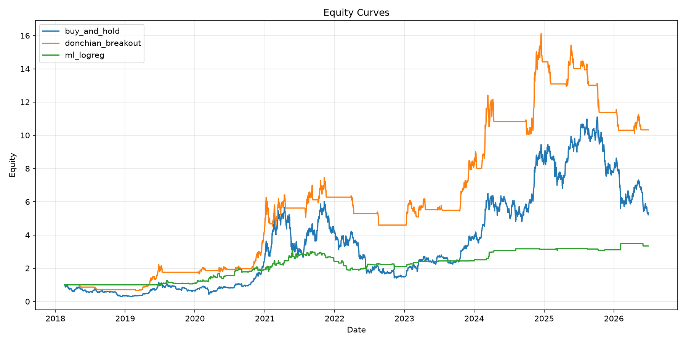
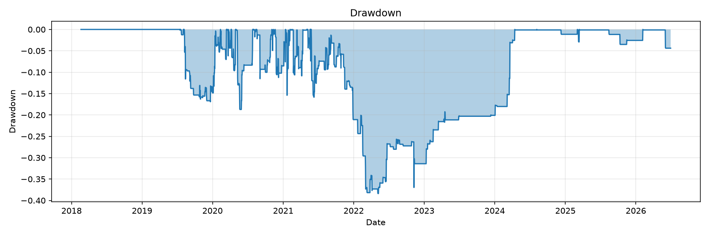
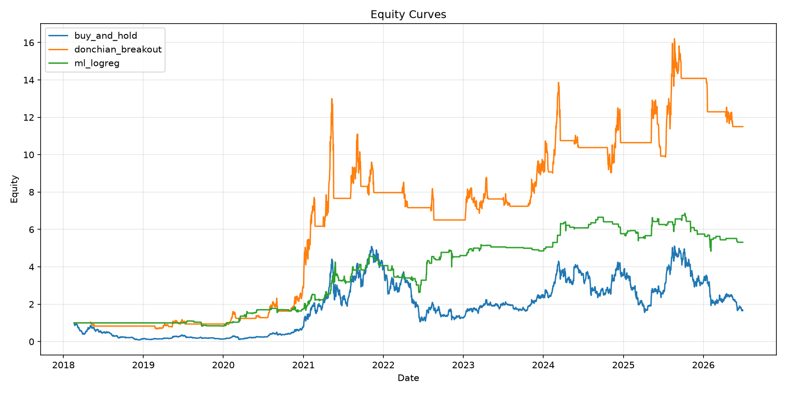
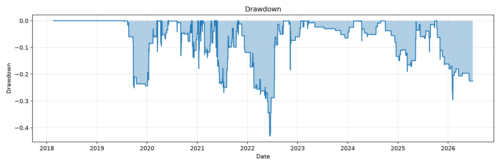
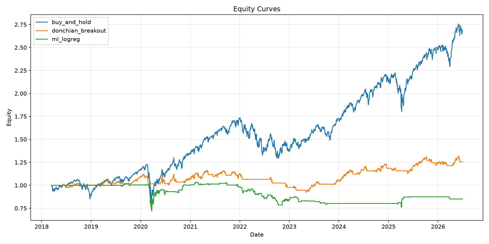
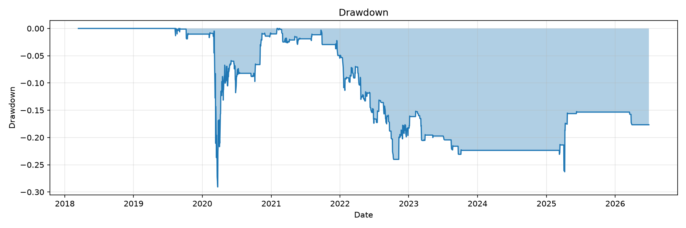

# Alpha Signal Research Lab

Учебный исследовательский проект по проверке простых торговых сигналов на дневных OHLCV-данных.

Проект не является инвестиционной рекомендацией. Результаты ниже описывают один воспроизводимый исследовательский прогон и не доказывают, что какая-либо стратегия пригодна для реальной торговли.

## Исследовательский вопрос

Может ли простой ML-сигнал на признаках моментума, волатильности и объема улучшить риск-скорректированную доходность относительно `Buy & Hold` и `Donchian Breakout` после walk-forward validation, комиссий и проскальзывания?

Короткий вывод по текущему прогону: **устойчивого подтверждения, что ML-сигнал лучше базовых стратегий после учета издержек, нет**. На `BTC-USD` и `ETH-USD` лучше выглядел `Donchian Breakout`, а на `SPY` лучше выглядел `Buy & Hold`. ML-сигнал оказался чувствителен к торговым издержкам из-за высокого оборота позиции.

## Область проекта

Что реализовано:

- загрузка дневных OHLCV-данных через `yfinance`;
- инструменты: `BTC-USD`, `ETH-USD`, `SPY`;
- построение признаков без заглядывания в будущее;
- базовая стратегия `Buy & Hold`;
- базовая стратегия `Donchian Breakout`;
- ML-сигнал через walk-forward `LogisticRegression`;
- альтернативная модель `RandomForestClassifier`;
- long/flat бэктест;
- комиссии и проскальзывание;
- метрики эффективности;
- CSV-отчет;
- графики через `matplotlib`;
- `pytest`-тесты для ключевых предположений бэктеста.

Что не реализовано:

- реальная торговля;
- кредитное плечо;
- симуляция стакана заявок;
- внутридневные данные;
- симуляция задержек;
- частичное исполнение заявок;
- funding rates;
- purged cross-validation.

## Структура репозитория

```text
.
├── README.md
├── pyproject.toml
├── requirements.txt
├── reports/
│   ├── results.csv
│   └── figures/
├── src/
│   └── alpha_lab/
│       ├── backtest.py
│       ├── data.py
│       ├── experiment.py
│       ├── features.py
│       ├── metrics.py
│       ├── plots.py
│       ├── strategies.py
│       └── validation.py
└── tests/
    ├── test_backtest_no_lookahead.py
    ├── test_costs.py
    └── test_metrics.py
```

## Методология

### Данные

Источник данных: Yahoo Finance через `yfinance`.

Инструменты:

- `BTC-USD`
- `ETH-USD`
- `SPY`

Загрузчик данных приводит названия колонок к единому формату:

- `open`
- `high`
- `low`
- `close`
- `volume`

Строки без корректного `close` удаляются.

### Признаки

Файл с признаками: `src/alpha_lab/features.py`.

Используемые признаки:

- `ret_1d`
- `ret_3d`
- `ret_7d`
- `volatility_7d`
- `volatility_21d`
- `volume_zscore_20`
- `price_vs_ma_20`
- `price_vs_ma_50`
- `rsi_14`
- `donchian_position_20`

Целевая переменная:

- `future_return_1d`
- `target = 1`, если `future_return_1d > cost_threshold`, иначе `0`

Важно: `future_return_1d` и `target` не используются как признаки модели.

### Стратегии

`Buy & Hold`:

- всегда находится в long-позиции.

`Donchian Breakout`:

- вход в long при пробое предыдущего rolling high;
- выход при пробое предыдущего rolling low;
- rolling high и rolling low используют `.shift(1)`, чтобы не использовать текущую цену в историческом уровне.

`ML Logistic Regression`:

- обучается через walk-forward validation;
- собирает out-of-sample вероятности;
- открывает long-позицию, если вероятность выше заданного порога.

### Валидация

ML-пайплайн использует `TimeSeriesSplit`, а не случайное разбиение.

Для каждого split:

1. Модель обучается на прошлом участке данных.
2. Модель предсказывает следующий будущий участок.
3. В итоговый сигнал попадают только out-of-sample вероятности.

Такой подход снижает риск обучения на будущих наблюдениях.

### Бэктест

Файл бэктеста: `src/alpha_lab/backtest.py`.

Предположения:

- доходности считаются close-to-close;
- только long/flat;
- без кредитного плеча;
- без исполнения на том же баре;
- без симуляции стакана;
- без частичных исполнений.

Ключевое правило против look-ahead bias:

```python
position = signal.shift(1)
```

Издержки:

```python
turnover = abs(position - previous_position)
costs = turnover * (fee_bps + slippage_bps) / 10000
```

Сценарии издержек:

- `no_costs`: `fee_bps=0`, `slippage_bps=0`;
- `binance_like`: `fee_bps=10`, `slippage_bps=2`;
- `high_cost`: `fee_bps=20`, `slippage_bps=8`.

## Результаты

Полный отчет сохранен в [`reports/results.csv`](reports/results.csv).

Ниже показан сценарий издержек `binance_like`.

| Инструмент | Стратегия | Общая доходность | Sharpe | Максимальная просадка | Доля прибыльных дней | Profit Factor | Оборот |
|---|---|---:|---:|---:|---:|---:|---:|
| BTC-USD | Donchian Breakout | 9.325 | 0.969 | -0.384 | 0.506 | 1.283 | 0.018 |
| BTC-USD | ML Logistic Regression | 2.341 | 0.727 | -0.384 | 0.338 | 1.394 | 0.137 |
| BTC-USD | Buy & Hold | 4.211 | 0.632 | -0.766 | 0.508 | 1.104 | 0.000 |
| ETH-USD | Donchian Breakout | 10.502 | 0.868 | -0.499 | 0.512 | 1.257 | 0.018 |
| ETH-USD | ML Logistic Regression | 4.313 | 0.764 | -0.431 | 0.319 | 1.416 | 0.158 |
| ETH-USD | Buy & Hold | 0.661 | 0.491 | -0.911 | 0.507 | 1.078 | 0.000 |
| SPY | Buy & Hold | 1.688 | 0.864 | -0.341 | 0.552 | 1.147 | 0.000 |
| SPY | Donchian Breakout | 0.256 | 0.424 | -0.208 | 0.540 | 1.088 | 0.025 |
| SPY | ML Logistic Regression | -0.149 | -0.114 | -0.291 | 0.341 | 0.951 | 0.119 |

### Основные наблюдения

1. `Donchian Breakout` имел лучший Sharpe на `BTC-USD` и `ETH-USD` в сценарии `binance_like`.
2. `Buy & Hold` имел лучший Sharpe на `SPY` в сценарии `binance_like`.
3. ML-сигнал не показал устойчивого превосходства над базовыми стратегиями после учета издержек.
4. Оборот ML-стратегии был заметно выше оборота базовых стратегий, поэтому результат сильнее ухудшался от комиссий и проскальзывания.
5. На `SPY` ML-стратегия стала отрицательной после учета издержек `binance_like`.

### Чувствительность ML-стратегии к издержкам

Общая доходность ML-стратегии по сценариям издержек:

| Инструмент | Без издержек | Binance-like | Высокие издержки |
|---|---:|---:|---:|
| BTC-USD | 4.512 | 2.341 | 0.712 |
| ETH-USD | 8.471 | 4.313 | 1.456 |
| SPY | 0.146 | -0.149 | -0.428 |

Главный вывод MVP: сигнал может выглядеть приемлемо до учета издержек, но заметно ухудшаться после учета реалистичного оборота позиции.

## Графики

BTC:





ETH:





SPY:





## Как запустить

Создать окружение:

```bash
python -m venv .venv
source .venv/bin/activate
pip install -r requirements.txt
pip install -e .
```

Запустить тесты:

```bash
pytest
```

Запустить эксперимент:

```bash
python -m alpha_lab.experiment
```

## Тесты

Текущие тесты проверяют:

- сдвиг позиции на один бар относительно сигнала;
- ухудшение доходности при более высоких издержках и положительном обороте;
- расчет максимальной просадки на известной кривой капитала;
- расчет Profit Factor на простом ряде доходностей.

Локальный результат тестов:

```text
4 passed
```

## Ограничения

Ограничения текущего MVP:

- только дневные OHLCV-данные;
- нет внутридневных данных;
- нет стакана заявок;
- нет частичных исполнений;
- фиксированная модель проскальзывания;
- нет симуляции задержек;
- нет funding rates;
- нет borrow costs;
- нет реальной торговли;
- нет кредитного плеча;
- нет подбора гиперпараметров;
- нет purged cross-validation;
- ограниченный набор инструментов;
- зависимость от доступности и качества данных Yahoo Finance.

Результаты следует рассматривать как учебное исследование, а не как торговую рекомендацию.

## Возможные следующие шаги

- добавить внутридневные данные через `ccxt`;
- добавить кэширование данных;
- добавить ускоренный бэктест через `numba`;
- добавить purged time-series split;
- добавить анализ чувствительности параметров;
- добавить feature importance;
- добавить анализ рыночных режимов;
- добавить Streamlit dashboard.

